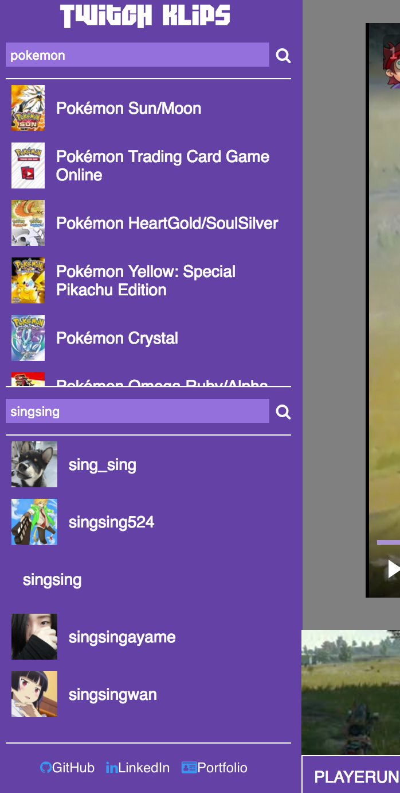

# TwitchKlips

[TwitchKlips live][pages]
[pages]: www.twitchklips.site

TwitchKlips is a project i designed while playing around with twitch's multiple APIs. It features React.js with a Redux architectural framework for it's front end and uses Twitch's API endpoints to display it's views.

## Features

### Nav bar



  Users can select any valid game to pull clips from using the `GameNavContainer`. Within the sidebar there is a `gamesList` Component that defaults to showing a list of trending games received from the twitch games API. Users can also search for any games in the twitch directory from the twitch search API and select from a list to view clips from that game. Because the top games and games search api endpoints responded with games lists in different formats, the `gamesList` had to be conditionally rendered depending on which API call was made.


  The `Trending` list item had to be manually created and added into the list in comparison to the API generated list which led to some interesting conditional rendering:

  ```javascript
  gamesList() {

    if(this.state.topList) {
      return(
        <ul className="game-list">
          <li className="game-item"
            onClick={this.handleGameGenreChange('Trending')}
            key={26}> //because generated list is limited to 25 results
            <div className="trending">
              <i className="fa fa-twitch" aria-hidden="true"></i>
            </div>
            <div className="game-item-title">Trending</div>
          </li>
          {this.games()}
        </ul>
      )
    } else {
      if(this.props.games === null) {
        return(
          <ul className="game-list">
            <div className="none-found-message">
              <div>
                Game Not Found!
              </div>
            </div>
          </ul>
        )
      } else {
        return(
          <ul className="game-list">
            {this.props.games.map( (game, idx) => {
              return(
                <li className="game-item"
                  onClick={this.handleGameGenreChange(game.name)}
                  key={idx}>
                  </img>
                  <div className="game-item-title">
                    {game.name}
                  </div>
                </li>
              )
            })}
          </ul>
        )
      }
    }
  }

  ```

  Users can also search for channels listed out in the `channelsList` Component. Results are pulled from the twitch search API and displayed in a list in the sidebar.

### Clip List and View

  When the user selects a channel or game from the sidebar, the `GenreReducer` and `GenreSourceReducer` both save the name of the channel/game and whether a channel or game have been selected in the state. The `ClipsList` Component then conditionally searches for channel or game clips depending on the `GenreSource` using the twitch clips API. Clips are then displayed in a list of thumbnails at the bottom of the `WatchWindow` Component. The list defaults to a list of trending clips from all games using a different variation of the twitch clips API.

  Different API calls depending on `GenreSource` state:

  ```javascript
  componentDidUpdate(prevProps) {

    if(prevProps !== this.props) {
      if(this.props.genre === 'Trending') {
        this.props.fetchTrendingClips();
      } else if(this.props.genreSource === "game") {
        this.props.fetchGameClips(this.props.genre);
      } else {
        this.props.fetchChannelClips(this.props.genre)
      }
    }
  }
  ```

  If the user finds a clip they want to watch, they can select the thumbnail which causes the `ClipReducer` to change the current clip state to the url of the clip. the `ClipView` then displays he twitch clip player to the user.

### Future features

### Chatbox

  I look forward to adding the real-time chat box to display the chat messages during the duration of the clip. This should help add context to many clips where the broadcaster is interacting with their chat.

### More API endpoints!

  To begin with, this was a fun project for playing around with twitch's api endpoints. I would love to possibly expand this app into a single page application and utilize some of their other APIs as well!
